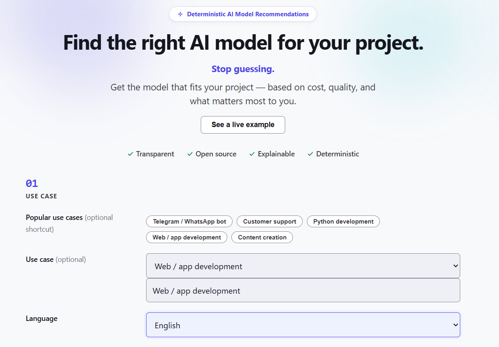
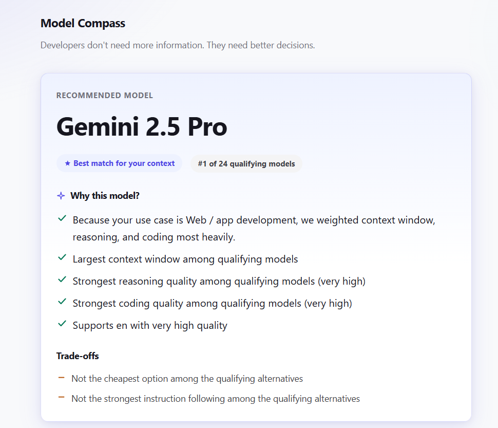
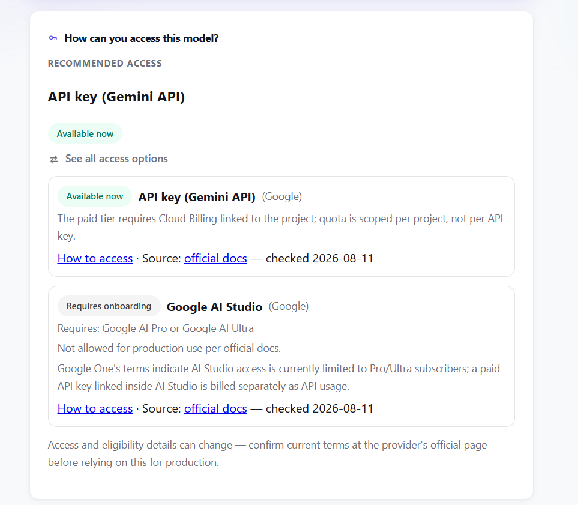
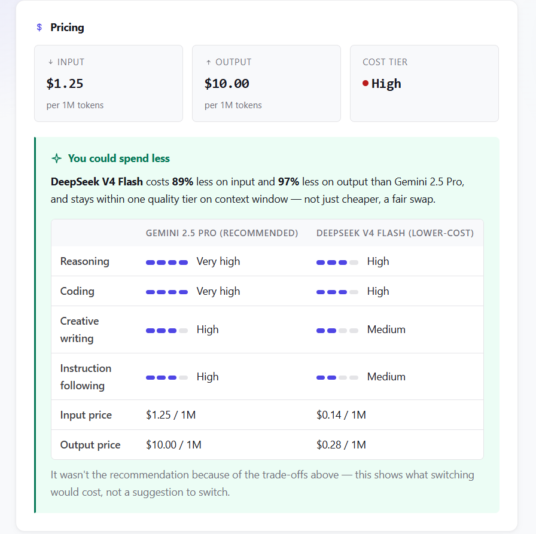

# Model Compass

> Developers don't need more information. They need better decisions.

**Stop guessing.**

**Status: Active development (Pre-1.0)**

Model Compass is functional end-to-end: the core recommendation engine,
explainability layer, web interface, and automated test suite are all
implemented. Current work is focused on visual polish, documentation,
and preparing for the first public release. See
[Getting Started](#getting-started) to run it locally.

---

## What is Model Compass?

Model Compass is an open-source decision engine that helps developers
choose the most suitable AI model for their specific use case.

Instead of comparing benchmarks, reading scattered provider documentation,
or guessing based on popularity, developers describe their context —
use case, budget, priorities, language, expected volume — and Model
Compass returns an explainable recommendation together with the
trade-offs behind every decision.

## The Problem

Choosing an AI model today means digging through inconsistent provider
docs, benchmarks that don't reflect real use cases, and opinions scattered
across forums and social media.

Most of that effort doesn't lead to a better decision — it just costs time.

Model Compass exists to answer one question directly:

**"What model should I use for this?"**

## See it in action



### 1. Tell Model Compass what you need

Use case, priorities ranked by what matters most, and a budget — as
much or as little detail as you have.

### 2. Get a recommendation with explainable trade-offs



Never just a model name — the reasons behind it, and what you're
giving up by not picking something else.

### 3. See how to access the recommended model



Access Advisor shows every documented route to the model — what's
available right now, what needs onboarding, and a link to the exact
steps.

### 4. Compare the economics



When a fair lower-cost alternative exists, Model Compass shows the
real trade-off side by side — not just "this is cheaper."

*Real screenshots from the app running locally against the live
dataset — not mockups.*

## Why Model Compass?

Model Compass focuses on decision making rather than information retrieval.

Instead of asking an AI model for an opinion, it evaluates your requirements
against a transparent and curated knowledge base to produce deterministic,
explainable recommendations.

Every recommendation can be understood, reviewed, and reproduced.

No leaderboards. No hidden heuristics. No affiliate links. Just
explainable recommendations.

## Getting Started

Requires Python 3.11+.

```bash
git clone https://github.com/LCAITECH/model-compass.git
cd model-compass
pip install -e ".[dev]"
```

Run the test suite:

```bash
pytest
```

Run the web interface locally:

```bash
uvicorn interfaces.web.app:app --reload
```

Then open `http://localhost:8000`.

## Core Principles

- **Explainability** — every recommendation comes with a reason, never
  just a model name.
- **Vendor neutrality** — no provider is favored. Recommendations depend
  on context, not on partnerships.
- **Transparency** — the dataset and the recommendation logic are public.
- **Deterministic recommendations** — results are based on explicit rules
  and curated data, not on opaque AI-generated opinions.
- **Community-driven dataset** — maintained in the open, versioned in Git,
  and improved through reviewed contributions.

## Roadmap

| Phase | Access form | Status |
|-------|-------------|--------|
| MVP   | Web app     | In progress |
| v2    | API         | Planned |
| v3    | Python SDK  | Planned |
| v4    | CLI         | Planned |

See [ROADMAP.md](./Docs/ROADMAP.md) for details.

## Contributing

Model Compass is in its early stages, and contributions — code, dataset
entries, ideas, feedback — are welcome.

See [CONTRIBUTING.md](./Docs/CONTRIBUTING.md) for guidelines on how to
get involved.

## License

MIT — see [LICENSE](./LICENSE.md) for details.

## Learn More

- [VISION.md](./Docs/VISION.md) — project mission and philosophy
- [ROADMAP.md](./Docs/ROADMAP.md) — where the project is headed
- [FEATURES.md](./Docs/FEATURES.md) — planned and existing features
- [ARCHITECTURE.md](./Docs/ARCHITECTURE.md) — technical design
- [SCHEMA.md](./Docs/SCHEMA.md) — how the dataset represents knowledge
- [CONTRIBUTING.md](./Docs/CONTRIBUTING.md) — how to contribute
- [CHANGELOG.md](./Docs/CHANGELOG.md) — what changed, and why, dated
